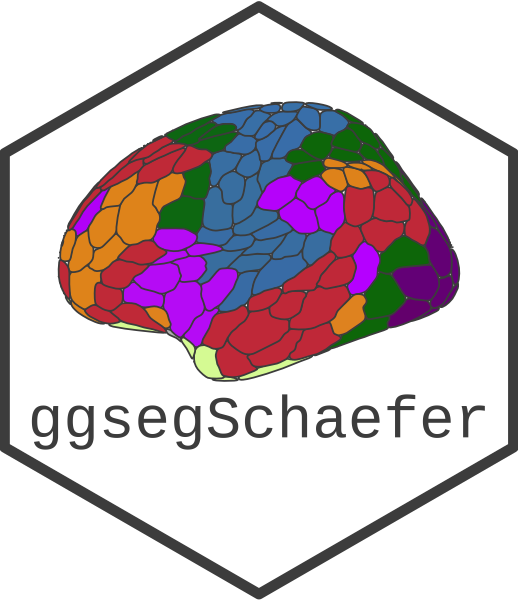

<!-- README.md is generated from README.Rmd. Please edit that file -->

```{r, include = FALSE}
knitr::opts_chunk$set(
  collapse = TRUE,
  comment = "#>",
  fig.path = "man/figures/README-",
  fig.width = 6,
  out.width = "100%"
)
Sys.setenv(PATH = paste("/opt/miniconda3/bin", Sys.getenv("PATH"),sep=":"))
```

# ggsegSchaefer   

<!-- badges: start -->
[](https://github.com/ggseg/ggsegSchaefer/actions)
[](https://zenodo.org/badge/latestdoi/250276444)
[](https://CRAN.R-project.org/package=ggsegSchaefer)
<!-- badges: end -->

This package contains dataset for plotting the Shaefer cortical atlas ggseg and ggseg3d. Now includes sets for the 17 and 7 network atlas, for parcellations 100:1000. 

## Installation

The best experience installing ggsegSchaefer is through the [ggseg r-universe](https://ggseg.r-universe.dev/ui#builds):

```{r, eval = FALSE}
# Enable this universe
options(repos = c(
    ggseg = 'https://ggseg.r-universe.dev',
    CRAN = 'https://cloud.r-project.org'))

# Install some packages
install.packages('ggsegSchaefer')
```


You can install the released version of ggsegSchaefer from [GitHub](https://github.com/) with:

``` r
# install.packages("remotes")
remotes::install_github("LCBC-UiO/ggsegSchaefer")
```

## Example

```{r}
library(ggsegSchaefer)
library(dplyr)
```

```{r, fig.height=10}

ggplot() +
  geom_brain(atlas = schaefer7_400,
             position = position_brain(hemi ~ side)) + 
  scale_fill_brain("schaefer7_400", package = "ggsegSchaefer") +
  guides(fill = FALSE)

ggplot() +
  geom_brain(atlas = schaefer17_100,
             position = position_brain(hemi ~ side)) + 
  scale_fill_brain("schaefer17_100", package = "ggsegSchaefer") +
  guides(fill = FALSE)
```

```{r "noneval", eval=FALSE}
ggseg3d(atlas = schaefer7_400_3d, surface = "inflated") %>% 
  pan_camera("right lateral")
```

```{r "orca", include=FALSE}
p <- ggseg3d(atlas = schaefer7_400_3d, surface = "inflated") %>%
  pan_camera("right lateral") %>%
  plotly::add_annotations( text="Screen capture",
                  legendtitle=TRUE, showarrow=FALSE,
                  font = list(color = "#000000b4",
                              family = 'sans serif',
                              size = 50))
plotly::orca(p, "man/figures/README-s7-3d-plot.png")
```

```{r "incl", echo=FALSE}
knitr::include_graphics("man/figures/README-s7-3d-plot.png")
```


```{r "noneval1", eval=FALSE}
ggseg3d(atlas = schaefer17_100_3d, surface = "inflated") %>% 
  pan_camera("right lateral")
```

```{r "orca1", include=FALSE}
p <- ggseg3d(atlas = schaefer17_3d, surface = "inflated") %>%
  pan_camera("right lateral") %>%
  plotly::add_annotations( text="Screen capture",
                  legendtitle=TRUE, showarrow=FALSE,
                  font = list(color = "#000000b4",
                              family = 'sans serif',
                              size = 50))
plotly::orca(p, "man/figures/README-s17-3d-plot.png")
```

```{r "incl1", echo=FALSE}
knitr::include_graphics("man/figures/README-s17-3d-plot.png")
```

Please note that the 'ggsegSchaefer' project is released with a
[Contributor Code of Conduct](CODE_OF_CONDUCT.md).
By contributing to this project, you agree to abide by its terms.
