<!-- README.md is generated from README.Rmd. Please edit that file -->

# ggsegSchaefer 

<!-- badges: start -->

[](https://github.com/ggseg/ggsegSchaefer/actions)
[](https://zenodo.org/badge/latestdoi/250276444)
[](https://CRAN.R-project.org/package=ggsegSchaefer)
<!-- badges: end -->

This package contains dataset for plotting the Shaefer cortical atlas
ggseg and ggseg3d. Now includes sets for the 17 and 7 network atlas, for
parcellations 100:1000.

## Installation

The best experience installing ggsegSchaefer is through the [ggseg
r-universe](https://ggseg.r-universe.dev/ui#builds):

``` r
# Enable this universe
options(repos = c(
    ggseg = 'https://ggseg.r-universe.dev',
    CRAN = 'https://cloud.r-project.org'))

# Install some packages
install.packages('ggsegSchaefer')
```

You can install the released version of ggsegSchaefer from
[GitHub](https://github.com/) with:

``` r
# install.packages("remotes")
remotes::install_github("LCBC-UiO/ggsegSchaefer")
```

## Example

``` r
library(ggsegSchaefer)
library(ggseg)
library(ggseg3d)
library(ggplot2)
library(dplyr)
#> 
#> Attaching package: 'dplyr'
#> The following objects are masked from 'package:stats':
#> 
#>     filter, lag
#> The following objects are masked from 'package:base':
#> 
#>     intersect, setdiff, setequal, union
```

### ggseg 2d atlases

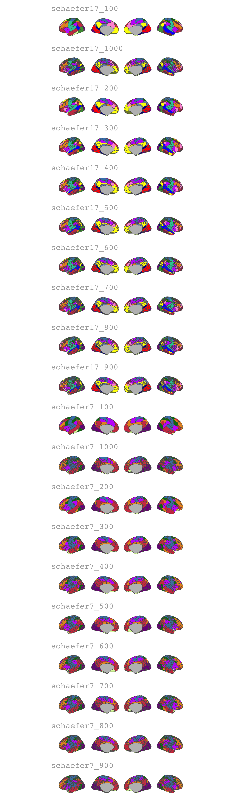

### ggseg 3d atlases

``` r
ggseg3d(atlas = schaefer7_400_3d, surface = "inflated") %>% 
  pan_camera("right lateral")
```

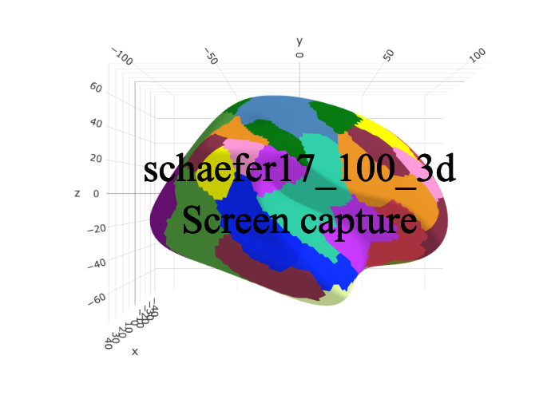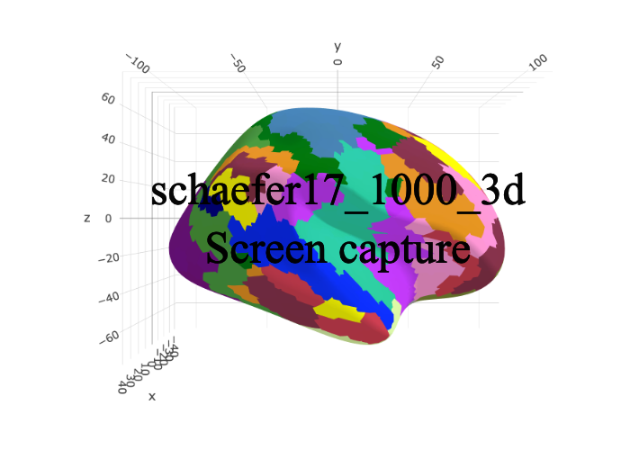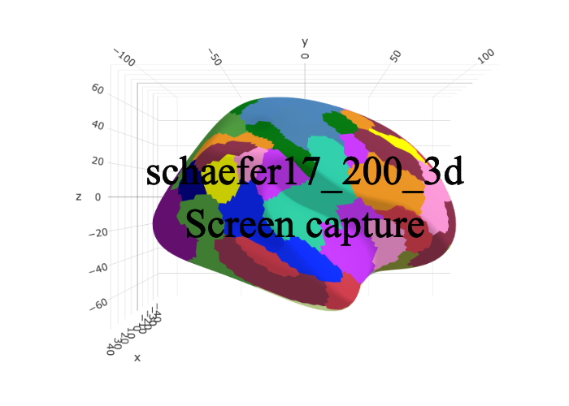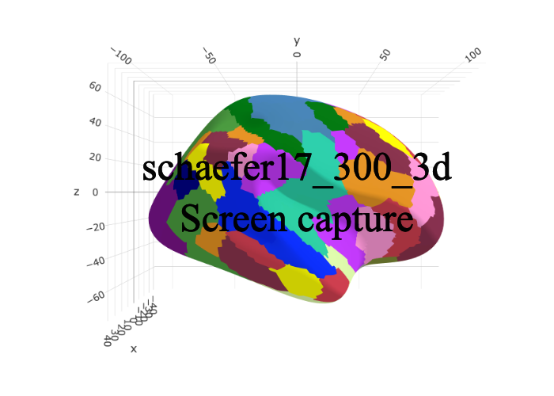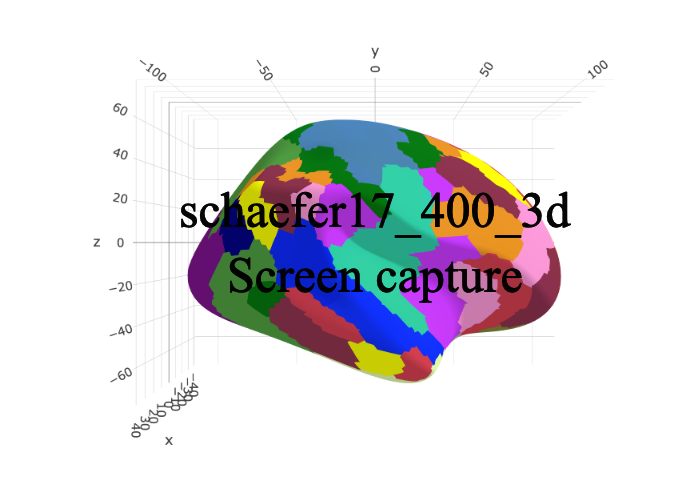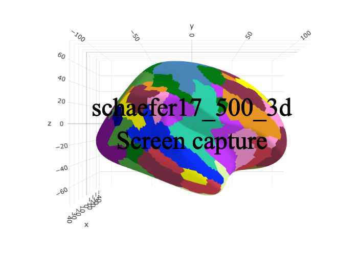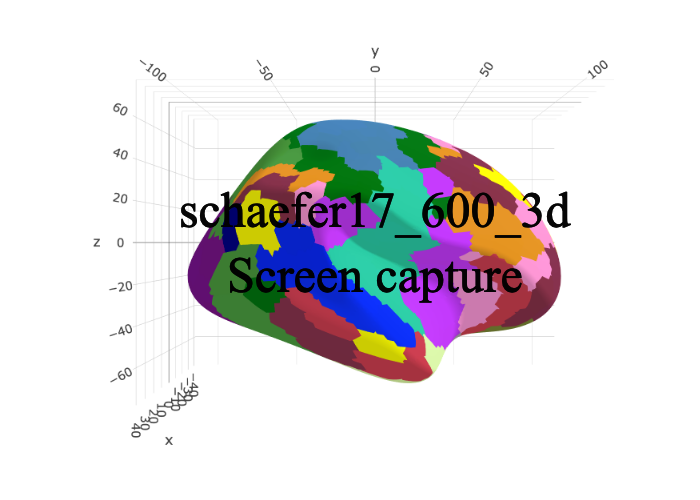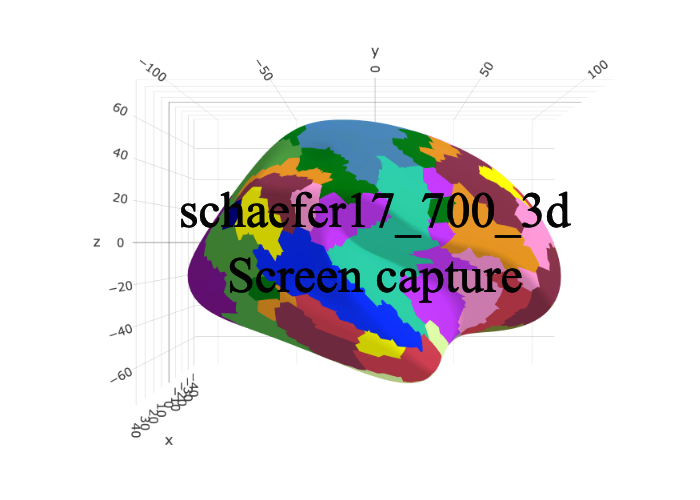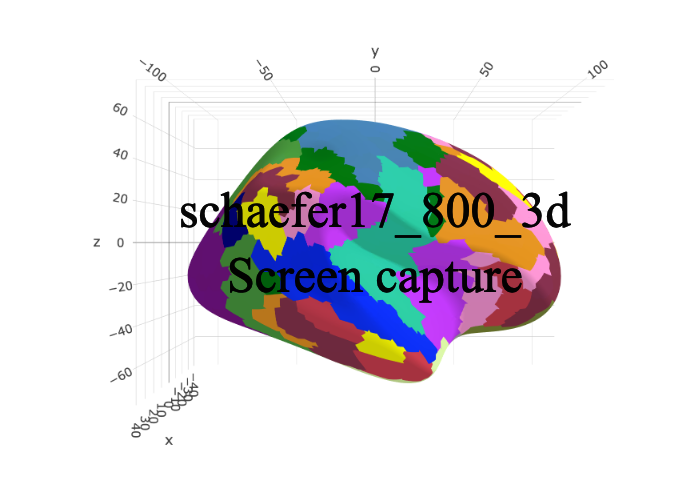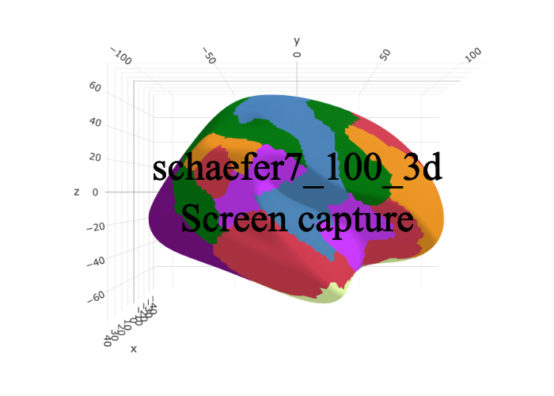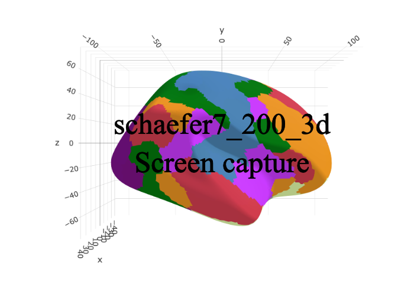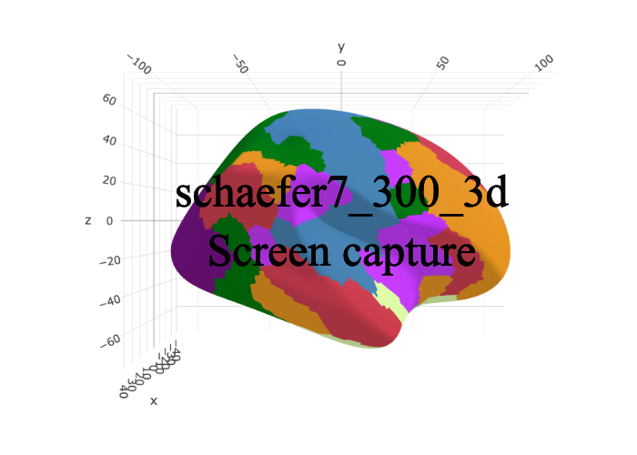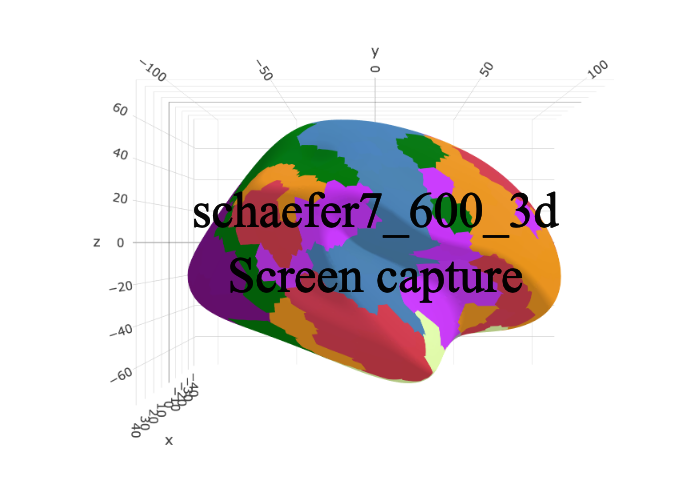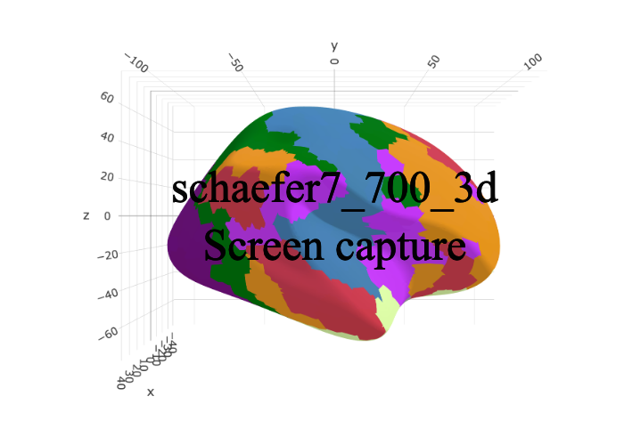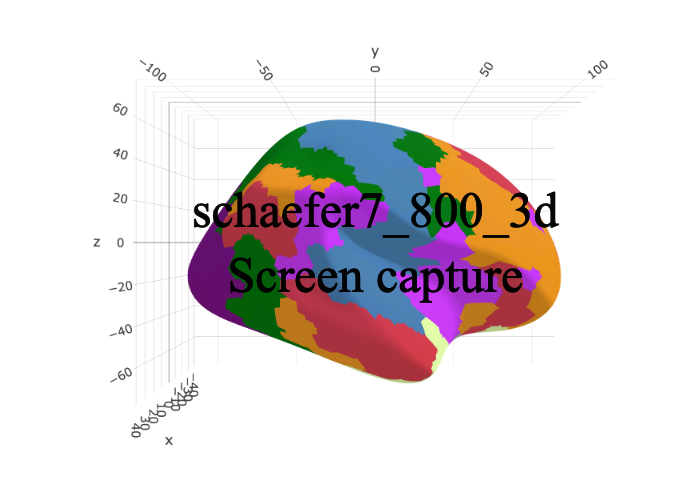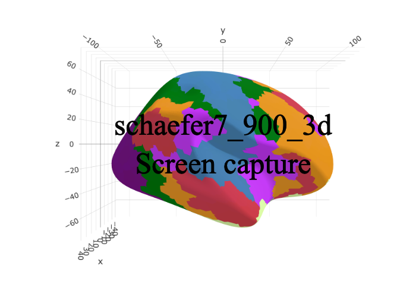

Please note that the ‘ggsegSchaefer’ project is released with a
[Contributor Code of Conduct](CODE_OF_CONDUCT.md). By contributing to
this project, you agree to abide by its terms.
