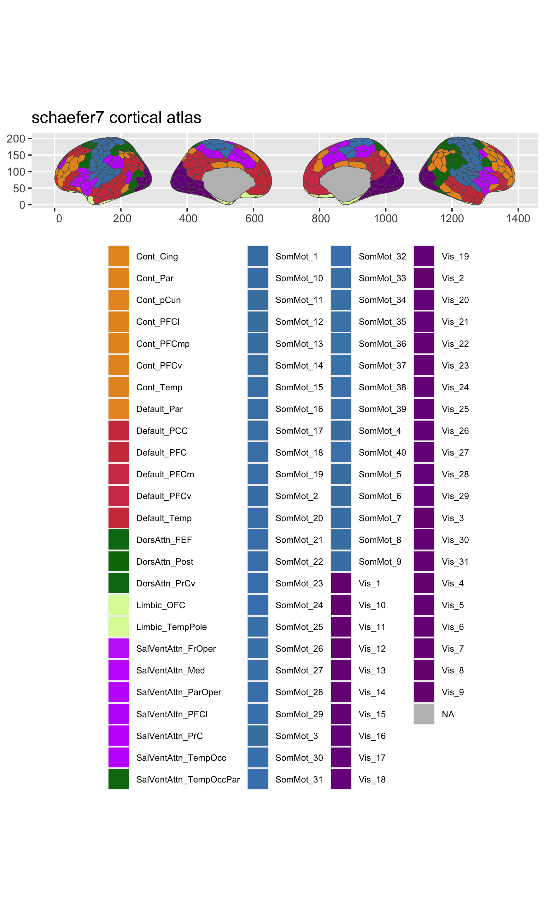
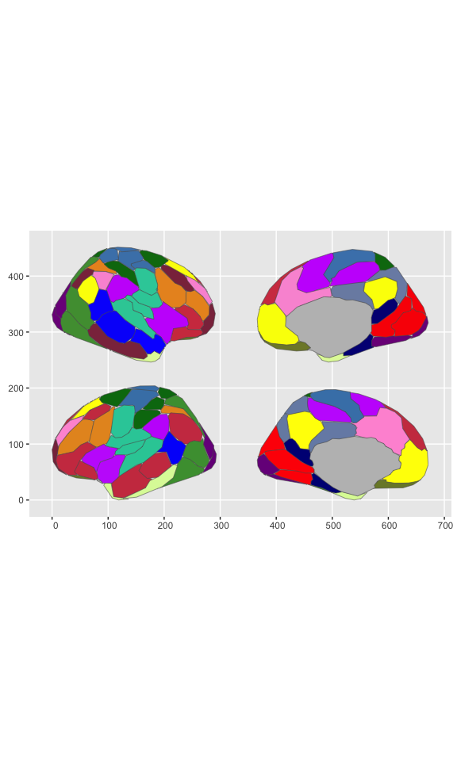

<!-- README.md is generated from README.Rmd. Please edit that file -->

# ggsegSchaefer

<!-- badges: start -->

[](https://codecov.io/gh/LCBC-UiO/ggsegSchaefer?branch=master)
[](https://github.com/ggseg/ggsegSchaefer/actions)
<!-- badges: end -->

This package contains dataset for plotting the Shaefer cortical atlas
ggseg and ggseg3d. Now includes sets for the 17 and 7 network atlas, for
parcellations 100:1000.

## Installation

The best experience installing ggsegSchaefer is through the [ggseg
r-universe](https://ggseg.r-universe.dev/ui#builds):

``` r
# Enable this universe
options(repos = c(
    ggseg = 'https://ggseg.r-universe.dev',
    CRAN = 'https://cloud.r-project.org'))

# Install some packages
install.packages('ggseg')
```

You can install the released version of ggsegSchaefer from
[GitHub](https://github.com/) with:

``` r
# install.packages("remotes")
remotes::install_github("LCBC-UiO/ggsegSchaefer")
```

## Example

``` r
library(ggsegSchaefer)
```

``` r
library(ggplot2)
library(ggseg)

ggplot() +
  geom_brain(atlas = schaefer7_400,
             position = position_brain(hemi ~ side)) + 
  scale_fill_brain("schaefer7_400", package = "ggsegSchaefer") +
  guides(fill = FALSE)
#> Warning: `guides(<scale> = FALSE)` is deprecated. Please use `guides(<scale> =
#> "none")` instead.
```



``` r
ggplot() +
  geom_brain(atlas = schaefer17_100,
             position = position_brain(hemi ~ side)) + 
  scale_fill_brain("schaefer17_100", package = "ggsegSchaefer") +
  guides(fill = FALSE)
#> Warning: `guides(<scale> = FALSE)` is deprecated. Please use `guides(<scale> =
#> "none")` instead.
```



``` r
library(ggseg3d)

ggseg3d(atlas = schaefer7_400_3d, surface = "inflated") %>% 
  pan_camera("right lateral")
```


``` r
library(ggseg3d)

ggseg3d(atlas = schaefer17_100_3d, surface = "inflated") %>% 
  pan_camera("right lateral")
```


Please note that the ‘ggsegSchaefer’ project is released with a
[Contributor Code of Conduct](CODE_OF_CONDUCT.md). By contributing to
this project, you agree to abide by its terms.
