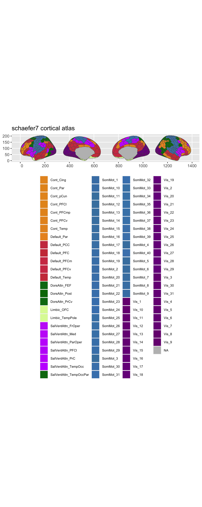
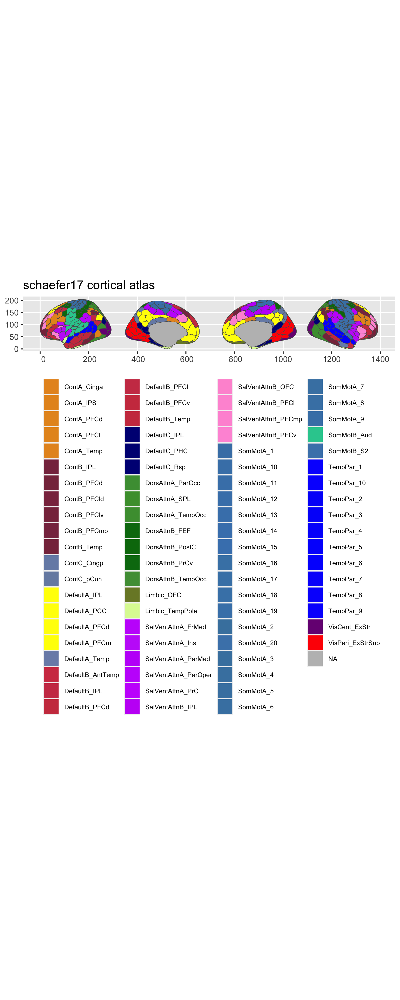
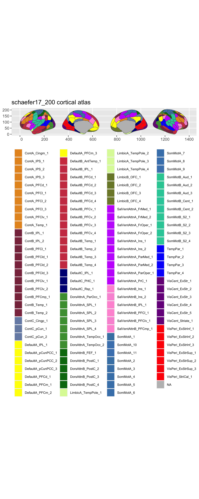
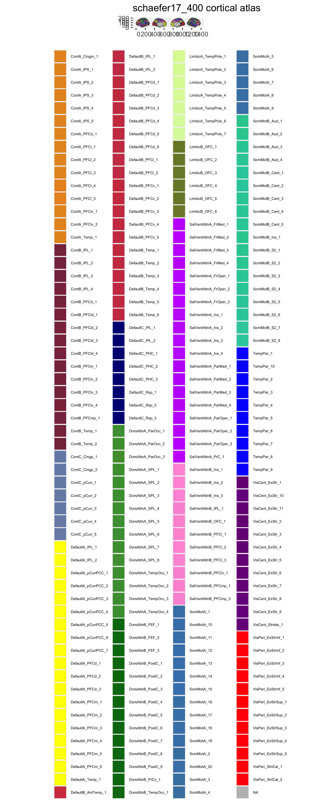
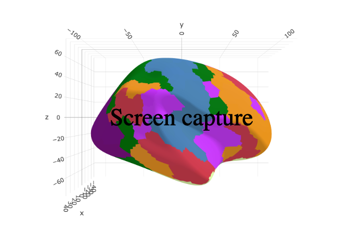
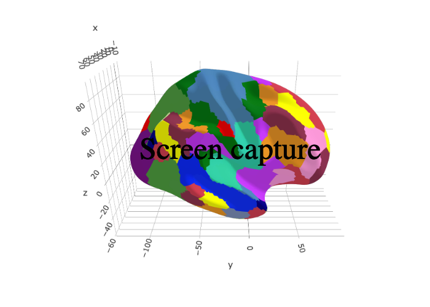
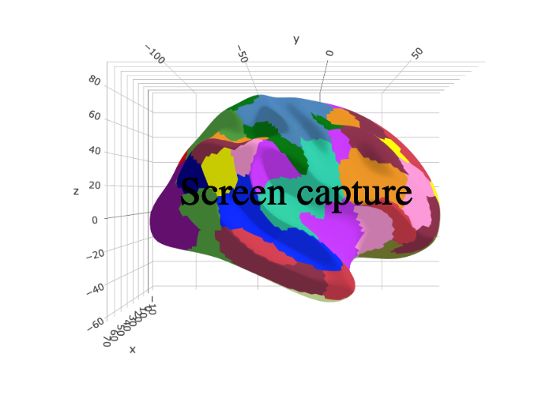
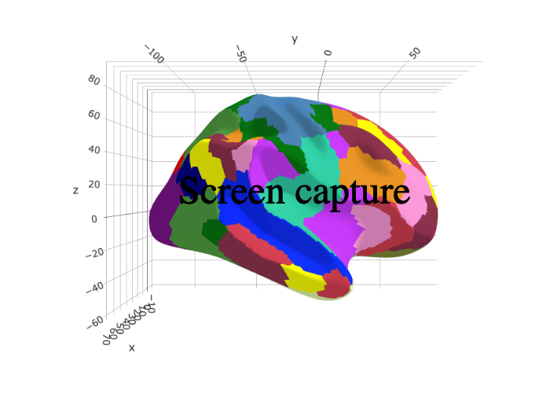

<!-- README.md is generated from README.Rmd. Please edit that file -->

# ggsegSchaefer

<!-- badges: start -->

[](https://travis-ci.com/LCBC-UiO/ggsegSchaefer)
[](https://ci.appveyor.com/project/LCBC-UiO/ggsegSchaefer)
[](https://codecov.io/gh/LCBC-UiO/ggsegSchaefer?branch=master)
[](https://github.com/LCBC-UiO/ggsegSchaefer/actions)
<!-- badges: end -->

This package contains dataset for plotting the Schaefer cortical atlas
ggseg and ggseg3d.

## Installation

You can install the released version of ggsegSchaefer from
[GitHub](https://github.com/) with:

``` r
# install.packages("remotes")
remotes::install_github("LCBC-UiO/ggsegSchaefer")
```

## Example

``` r
library(ggsegSchaefer)
```

``` r
library(ggseg)
#> Loading required package: ggplot2

plot(schaefer7) +
  theme(legend.position = "bottom",
        legend.text = element_text(size = 7)) +
  guides(fill = guide_legend(ncol = 4))
```



``` r

plot(schaefer17) +
  theme(legend.position = "bottom",
        legend.text = element_text(size = 7)) +
  guides(fill = guide_legend(ncol = 4))
```



``` r

plot(schaefer17_200) +
  theme(legend.position = "bottom",
        legend.text = element_text(size = 7)) +
  guides(fill = guide_legend(ncol = 4))
```



``` r

plot(schaefer17_400) +
  theme(legend.position = "bottom",
        legend.text = element_text(size = 5)) +
  guides(fill = guide_legend(ncol = 4))
```



``` r
library(ggseg3d)
library(dplyr)

ggseg3d(atlas = schaefer7_3d) %>% 
  pan_camera("right lateral")
```



``` r
library(ggseg3d)

ggseg3d(atlas = schaefer17_3d) %>% 
  pan_camera("right lateral")
```



``` r
ggseg3d(atlas = schaefer17_200_3d) %>% 
  pan_camera("right lateral")
```



``` r
ggseg3d(atlas = schaefer17_400_3d) %>% 
  pan_camera("right lateral")
```



Please note that the ‘ggsegSchaefer’ project is released with a
[Contributor Code of Conduct](CODE_OF_CONDUCT.md). By contributing to
this project, you agree to abide by its terms.
