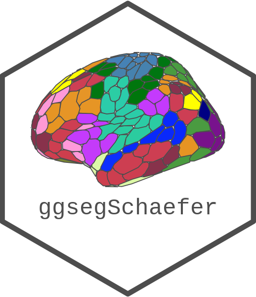

<!-- README.md is generated from README.Rmd. Please edit that file -->

# ggsegSchaefer 

<!-- badges: start -->

[](https://zenodo.org/badge/latestdoi/250276444)
[](https://codecov.io/gh/LCBC-UiO/ggsegSchaefer?branch=master)
[](https://github.com/LCBC-UiO/ggsegSchaefer/actions)
<!-- badges: end -->

This package contains dataset for plotting the Shaefer cortical atlas
ggseg and ggseg3d.

## Installation

We recommend installing the ggseg-atlases through the ggseg
[r-universe](https://ggseg.r-universe.dev/ui#builds):

``` r
# Enable this universe
options(repos = c(
    ggseg = 'https://ggseg.r-universe.dev',
    CRAN = 'https://cloud.r-project.org'))

# Install some packages
install.packages('ggsegSchaefer')
```

You can install the released version of ggsegSchaefer from
[GitHub](https://github.com/) with:

``` r
# install.packages("remotes")
remotes::install_github("LCBC-UiO/ggsegSchaefer")
```

## Example

``` r
library(ggsegSchaefer)
```

``` r
library(ggseg)
library(ggplot2)

plot(schaefer7) +
  theme(legend.position = "bottom",
        legend.text = element_text(size = 7)) +
  guides(fill = guide_legend(ncol = 4))
```


``` r
plot(schaefer17) +
  theme(legend.position = "bottom",
        legend.text = element_text(size = 7)) +
  guides(fill = guide_legend(ncol = 4))
```


``` r
library(ggseg3d)
library(dplyr)

ggseg3d(atlas = schaefer7_3d) %>% 
  pan_camera("right lateral")
```


``` r
library(ggseg3d)

ggseg3d(atlas = schaefer17_3d) %>% 
  pan_camera("right lateral")
```


Please note that the ‘ggsegSchaefer’ project is released with a
[Contributor Code of Conduct](CODE_OF_CONDUCT.md). By contributing to
this project, you agree to abide by its terms.
